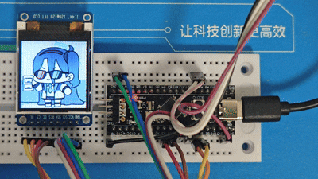

# ST7735S Library
This is an ST7735S driver library which is based on the STM32 HAL Library.  
## 🌟Features
- Full Hardware Abstraction: Built upon the STM32 HAL, which enables easy portability across the STM32 product family.
- High Performance: Verified to operate reliably at SPI clock rates of up to 50 MHz, a speed that maximizes the display's refresh rate.
- Essential Functionality: Includes fundamental operations, such as display initialization, filling the screen, and drawing images.
- Simple API: Features a clean and well-documented interface that makes integration into your project straightforward.
- Backlight Control: Provides simple functions for managing the display's backlight.
## 🌟Supported Hardware
This driver is designed to work with STM32 microcontrollers for which the STM32Cube HAL library is available. It has been tested on an STM32F4 series but is readily portable to other series (e.g., F0, F1, F3, F7, H7).
## 🌟Requirements
- A STM32 microcontroller that supports SPI and GPIO peripherals.
- The STM32Cube HAL library corresponding to your MCU series (e.g., stm32f4xx_hal.h).
- An ST7735S-based TFT LCD display.
- An IDE/Toolchain that is compatible with STM32 development(make,Keil,etc).
## 🌟Hardware Connection
Connect your display to the MCU as shown in the table below. The pin names on the display side may vary slightly.

| Display | MCU Pin Function | Required MCU Pin Configuration |
| :----------- | :---------------- | :-------------------------------- |
|`VCC`|3.3V / 5V   |Power Supply 
|`GND`|GND         |Ground
|`SCL`|SPI SCL     |SPI Serial Clock
|`SDA`|SPI MOSI    |SPI Master Out Slave In
|`RES`|GPIO Output |Hardware Reset (Active Low)
|`DC` |GPIO Output |Data/Command Control
|`CS` |GPIO Output |Chip Select (Active Low)
|`BL` |GPIO Output |Backlight Control
> **Note**: The `MISO` pin is not required for this display. The SPI peripheral can be configured in `Transmit Only Master` or `Full-Duplex Master mode`(in STM32CubeMX).

> **Note**: `The Maximum output speed` of the `DC`, `CS`, and `RES` pins should be set to `Very High`.And at the same time, the `GPIO output level` of these pins should be set to `High`(in STM32CubeMX).

## 🌟Usage
### 1. Include the Library
Add `ST7735S.c` and `ST7735S.h` to your project and include the header file.  
```c
#include "ST7735S.h"
```
### 2. Initialize the TFT_pins Structure
Populate the TFT_pins struct with your specific pin and SPI configuration. This struct, which holds all the hardware dependencies, is then passed to every function.
```c
TFT_pins my_pins; // Define a global struct for the display

// In your main()
my_pins.spi = &hspi1; // Your SPI Handle from CubeMX (e.g., hspi1)
my_pins.DC_port = GPIOA;  my_pins.DC_pins = GPIO_PIN_3; //PA3
my_pins.RES_port = GPIOA; my_pins.RES_pins = GPIO_PIN_4; //PA4
my_pins.CS_port = GPIOB;  my_pins.CS_pins = GPIO_PIN_0; //PB0
my_pins.BL_port = GPIOB;  my_pins.BL_pins = GPIO_PIN_1; //PB1
```
### 3. Initialize the Display
Call the initialization function, which sends the necessary sequence of commands to power on and configure the display.
```c
ST7735_Init(&my_pins); // Initialize the display
ST7735_BL_on(&my_pins, true); // Turn on the backlight
```
### 4.Use the Drawing Functions
```c
// Fill the entire screen with a color
ST7735_Fill_Screen(&my_pins, 0xF800, 1, 1, 128, 128);//(e.g., RED in RGB565)
ST7735_Fill_Screen(&my_pins, 0x07E0, 1, 1, 128, 128);//(e.g., GREEN in RGB565)
ST7735_Fill_Screen(&my_pins, 0x001F, 1, 1, 128, 128);//(e.g., BLUE in RGB565)

// To draw an image, prepare a buffer in RGB565 format
const uint8_t pic[128*128*2] = { ... }; //Like this
ST7735_Show_img(&my_pins,pic,1,1,128,128);
```
## 🌟Porting to Other STM32 Series
The core driver logic is hardware-agnostic. To port this library:  
1. Change the HAL Header: Replace #include "stm32f4xx_hal.h" in ST7735S.h with the header for your target series (e.g., #include "stm32f1xx_hal.h").
2. Update the TFT_pins Struct: Adjust the GPIO_TypeDef ports and pin numbers in your application code to match your new hardware design.

## 🌟Performance Note
This driver has been tested to work stably at **SPI clock speeds of up to 50 MHz** on an STM32F411 microcontroller. The achievable speed is highly dependent on the performance of your MCU, the quality of your display module, and your PCB layout. If you encounter issues, try reducing the SPI baud rate.

## 📜License
This project is licensed under the MIT License - see the LICENSE file for details.

## 🤝Contributing
Contributions are welcome! Please feel free to submit pull requests or open issues to suggest improvements or report bugs.

## 🐱About the Author
A student who just graduated from high school, this is the code I wrote while learning.The code may be immature, but the functionality is definitely useful! Please give me more guidance from all the experts.(If a bug is found, it is definitely not a bug, it is a feature, a feature! 😭)

---
# ST7735S 库
这是一个基于STM32 HAL库的ST7735S驱动库
## 🌟特点：
- 完全硬件抽象：基于STM32 HAL构建，可轻松跨STM32产品系列进行移植
- 高性能：经验证，可在高达50 MHz的SPI时钟频率下可靠运行，该速度可最大限度地提高显示器的刷新率
- 基本功能：包括基本操作，如显示初始化、填充屏幕和绘制图像
- 简单的API：具有一个干净且文档齐全的接口，可以直接集成到项目中
- 背光控制：提供管理显示器背光的简单功能
## 🌟支持的硬件：
此驱动程序旨在与STM32Cube HAL库可用的STM32微控制器配合使用。它已经在STM32F4系列上进行了测试，很容易移植到其他系列（例如F0、F1、F3、F7、H7）
## 🌟要求：
- 一个支持SPI和GPIO的STM32
- 与MCU系列对应的STM32Cube HAL库（例如stm32f4xx_HAL.h）
- 一个驱动为ST7735S的TFT LCD显示屏
- 与STM32开发兼容的IDE/工具链（make、Keil等）
## 🌟硬件连接
如下表所示，将显示器连接到MCU。显示屏侧的引脚名称可能略有不同

| 显示屏 | mcu引脚功能 | 所需MCU引脚配置 |
| :----------- | :---------------- | :-------------------------------- |
|`VCC`|3.3V / 5V   |电源 
|`GND`|GND         |地
|`SCL`|SPI SCL     |SPI时钟
|`SDA`|SPI MOSI    |SPI Master Out Slave In [嘶，这个好像没必要翻译]
|`RES`|GPIO Output |硬件重启（低电平有效）
|`DC` |GPIO Output |命令/数据控制
|`CS` |GPIO Output |片选（低电平有效）
|`BL` |GPIO Output |背光控制
> **提示**: 此显示器不需要`MISO`引脚。SPI外设可以配置为`Transmit Only Master` 或 `Full-Duplex Master mode`（在 STM32CubeMX）。

> **提示**: `DC`, `CS`, `RES`引脚在`The Maximum output speed`设置中应当设置为`Very High`。同时， 这些引脚的 `GPIO output level`设置也应当设置为 `High`（在 STM32CubeMX）。

## 🌟用法：
### 1. 包含库文件
添加 `ST7735S.c` 和 `ST7735S.h` 到您的项目中，然后在代码中包含该库的头文件。
```c
#include "ST7735S.h"
```
### 2. 初始化 TFT_pins 结构体
用您的特定引脚和SPI配置填充TFT_pins结构。这个结构体包含所有硬件依赖关系，然后传递给每个函数。
```c
TFT_pins my_pins; // 为显示屏引脚定义一个全局结构体

// 在您的 main() 函数中
my_pins.spi = &hspi1; // CubeMX的SPI句柄（例如hspi1）
my_pins.DC_port = GPIOA;  my_pins.DC_pins = GPIO_PIN_3; //PA3
my_pins.RES_port = GPIOA; my_pins.RES_pins = GPIO_PIN_4; //PA4
my_pins.CS_port = GPIOB;  my_pins.CS_pins = GPIO_PIN_0; //PB0
my_pins.BL_port = GPIOB;  my_pins.BL_pins = GPIO_PIN_1; //PB1
```
### 3. 初始化显示屏
调用显示屏初始化函数，该函数发送必要的命令序列以打开电源并配置显示屏。
```c
ST7735_Init(&my_pins); // 初始化显示屏
ST7735_BL_on(&my_pins, true); // 打开背光灯
```
### 4.使用绘图功能
```c
// 用颜色填充整个屏幕
ST7735_Fill_Screen(&my_pins, 0xF800, 1, 1, 128, 128);//(例子, RGB565格式下的红色)
ST7735_Fill_Screen(&my_pins, 0x07E0, 1, 1, 128, 128);//(例子, RGB565格式下的绿色)
ST7735_Fill_Screen(&my_pins, 0x001F, 1, 1, 128, 128);//(例子, RGB565格式下的蓝色)

// 要绘制图像，请准备RGB565格式的缓冲区
const uint8_t pic[128*128*2] = { ... }; //像这样
ST7735_Show_img(&my_pins,pic,1,1,128,128);
```
## 🌟移植到其他的STM32：
核心驱动程序逻辑与硬件无关。如果您要移植该库，请执行以下操作： 
1. 更改HAL头文件：将ST7735S.h中的`#include“stm32f4xx_HAL.h”`替换为目标系列的标题（例如`#include“stm32f1xx_HAL.h`）。
2. 检查你的 TFT_pins 结构体：调整应用程序代码中的GPIO_TypeDef端口和引脚号，以匹配新的硬件。

## 🌟性能说明
该驱动程序已在STM32F411 mcu上测试，可在高达50MHz的SPI时钟速度下稳定工作。可达到的速度在很大程度上取决于mcu的性能、显示模块和PCB布局的质量。如果遇到玄学问题，请尝试降低SPI波特率。

## 📜许可证
此项目根据MIT许可证获得许可-有关详细信息，请参阅许可证文件。

## 🤝贡献
欢迎为项目添砖加瓦！请随时提交 Pull Request 或提出问题来建议改进或报告错误。

## 🐱关于作者
一只刚高中毕业的学牲，这是我边学边写的代码。代码可能很稚嫩，但功能绝对好用！请各位大佬多多指教。（如果发现BUG，那一定不是BUG，是特性，特性！😭）

## ✨IMG/图片
